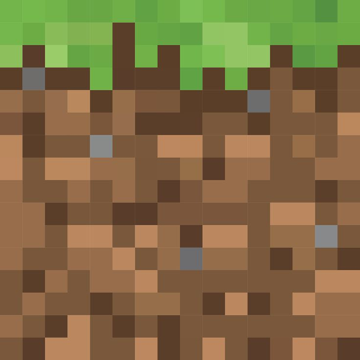

<p align="center">
    
</p>

# 🌍 Minecraft Clone

Welcome to the Minecraft Clone project! 🛠️

This is a simple Minecraft-inspired game built with TypeScript and Three.js. The project is currently under development.

## 📦 Getting Started

1. **Install dependencies:**
   ```zsh
   npm install
   ```
2. **Start the development server:**
   ```zsh
   npm run dev
   ```
3. **Open your browser:**
   Visit [http://localhost:5173](http://localhost:5173) to see the game in action.

## 📁 Project Structure

- `src/` — Main source code
- `public/` — Static assets (textures, icons)
- `index.html` — Entry point
